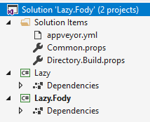

# Write an Addin


## Naming conventions

Fody provides a set of tools that simplify the building of a weaver addin. To benefit from of all this functionality, follow this naming conventions:

|                  | |
|------------------|-|
| Repository Name: | `https://github.com/MyOrganization/MyAddin.Fody` |
| Solution Name:   | MyAddin.Fody |
| Weaver project Name: | MyAddin.Fody |
| Weaver runtime project name: | MyAddin |


## Building a weaver from the scratch

Create a solution with two projects, a `Directory.Build.props` file and an `appveyor.yml` file:



 * In this sample the '.props' have been split into two files, to have the project specific settings in their own file.


### Lib/Reference project

MyAddin.csproj:

 * This project can host attributes that users apply to their code to control the addin.
 * This project also generates the NuGet package.
 * This project must references the `FodyPackaging` package.
 * The target frameworks depend on what targets the weaver can support (see [Supported Runtimes And Ide](supported-runtimes-and-ide.md))

```xml
<Project Sdk="Microsoft.NET.Sdk">

  <PropertyGroup>
    <TargetFrameworks>net40;netstandard1.0;netstandard2.0</TargetFrameworks>
    <GenerateDocumentationFile>true</GenerateDocumentationFile>
    <PackageLicenseExpression>MIT</PackageLicenseExpression>
    <Version>1.0</Version>
    <Copyright>Copyright Me $([System.DateTime]::UtcNow.ToString(yyyy)).</Copyright>
    <Description>What my addin does.</Description>
  </PropertyGroup>

  <ItemGroup>
    <PackageReference Include="FodyPackaging"
                      Version="3.2.17"
                      PrivateAssets="All"/>
    <PackageReference Include="Fody"
                      Version="3.2.17"
                      PrivateAssets="None"/>
  </ItemGroup>

</Project>
```


## Weaver Project

MyAddin.Fody.csproj:

 * This project contains the weaving code.
 * This project must references the `FodyHelpers` package.
 * Target frameworks must be `net46` and `netstandard2.0`.
 * The weaver assembly is the assembly suffixed with ".Fody".
 * It should not have any runtime dependencies (excluding Mono Cecil); runtime dependencies should be combined using e.g. [ILMerge](https://github.com/dotnet/ILMerge) and the `/Internalize` flag.
 * The assembly must contain a public class named 'ModuleWeaver'. The namespace does not matter.

```xml
<Project Sdk="Microsoft.NET.Sdk">

  <PropertyGroup>
    <TargetFrameworks>net46;netstandard2.0</TargetFrameworks>
  </PropertyGroup>

  <ItemGroup>
    <PackageReference Include="FodyHelpers"
                      Version="3.2.17" />
  </ItemGroup>

</Project>
```


### The ModuleWeaver Class

Add a public class named 'ModuleWeaver', which derives from the `BaseModuleWeaver` class provided by the `FodyHelpers` assembly, to the project.

 * Inherit from `BaseModuleWeaver`.
 * The class must be public, non static, and not abstract.
 * Have an empty constructor.

For example the minimum class would look like this

<!-- snippet: ModuleWeaver -->
```cs
public class ModuleWeaver : BaseModuleWeaver
{
    public override void Execute()
    {
        var objectType = FindType("System.Object");
        var objectImport = ModuleDefinition.ImportReference(objectType);
        ModuleDefinition.Types.Add(new TypeDefinition("MyNamespace", "MyType", TypeAttributes.Public, objectImport));
    }

    public override IEnumerable<string> GetAssembliesForScanning()
    {
        return Enumerable.Empty<string>();
    }
}
```
<sup>[snippet source](/src/Docs/Snippets/ModuleWeaver.cs#L6-L23)</sup>
<!-- endsnippet -->


### Throwing exceptions

When writing an addin there are a points to note when throwing an Exception.

 * Exceptions thrown from an addin will be caught and interpreted as a build error. So this will stop the build.
 * The exception information will be logged to the MSBuild `BuildEngine.LogErrorEvent` method.
 * If the exception type is `WeavingException` then it will be interpreted as an "error". So the addin is explicitly throwing an exception with the intent of stopping processing and logging a simple message to the build log. In this case the message logged will be the contents of `WeavingException.Message` property. If the `WeavingException` has a property `SequencePoint` then that information will be passed to the build engine so a user can navigate to the error.
 * If the exception type is *not* a `WeavingException` then it will be interpreted as an "unhandled exception". So something has gone seriously wrong with the addin. It most likely has a bug. In this case message logged be much bore verbose and will contain the full contents of the Exception. The code for getting the message can be found here in [ExceptionExtensions](https://github.com/Fody/Fody/blob/master/FodyCommon/ExceptionExtensions.cs).


## Build Server


### AppVeyor

To configure an adding to build using [AppVeyor](https://www.appveyor.com/) use the following `appveyor.yml`:

```yml
image: Visual Studio 2017
build_script:
- cmd: dotnet build --configuration Release
test:
  assemblies:
    - '**\*Tests.dll'
artifacts:
- path: nugets\*.nupkg
```


## Configuration via FodyWeavers.xml

This file exists at a project level in the users target project and is used to pass configuration to the 'ModuleWeaver'.

So if the FodyWeavers.xml file contains the following

```xml
<?xml version="1.0" encoding="utf-8" ?>
<Weavers>
  <MyAddin MyProperty="PropertyValue"/>
</Weavers>
```

The Config property of the ModuleWeaver will be an XElement containing

```xml
<MyAddin MyProperty="PropertyValue"/>
```


## Supporting intellisense for FodyWeavers.xml

Fody will create or update a schema file (FodyWeavers.xsd) for every FodyWeavers.xml during compilation, adding all detected weavers. Every weaver now can provide a schema fragment describing it's individual properties and content that can be set. This file must be part of the weaver project and named `<project name>.xcf`. It contains the element describing the type of the configuration node. The file must be published side by side with the weaver file; however FodyPackaging will configure this correctly based on the convention `WeaverName.Fody.xcf`.

Sample content of the `MyAddin.Fody.xcf`:

```xml
<xs:complexType xmlns:xs="http://www.w3.org/2001/XMLSchema">
  <xs:all>
    <xs:element name="Content" type="xs:string" minOccurs="0" maxOccurs="1">
      <xs:annotation>
        <xs:documentation>This is the documentation for the content</xs:documentation>
      </xs:annotation>
    </xs:element>
  </xs:all>
  <xs:attribute name="MyProperty" type="xs:string">
    <xs:annotation>
      <xs:documentation>This is the documentation for my property</xs:documentation>
    </xs:annotation>
  </xs:attribute>
  <xs:attribute name="AnotherProperty" type="xs:string" >
    <xs:annotation>
      <xs:documentation>This is the documentation for another property</xs:documentation>
    </xs:annotation>
  </xs:attribute>
</xs:complexType>
```

Fody will then combine all `.xcf` fragments with the weavers information to the final `.xsd`:

```xml
<?xml version="1.0" encoding="utf-8"?>
<xs:schema xmlns:xs="http://www.w3.org/2001/XMLSchema">
  <xs:element name="Weavers">
    <xs:complexType>
      <xs:all>
        <xs:element name="MyAddin" minOccurs="0" maxOccurs="1">
          <xs:complexType>
            <xs:all>
              <xs:element name="Content" type="xs:string" minOccurs="0" maxOccurs="1">
                <xs:annotation>
                  <xs:documentation>This is the documentation for the content</xs:documentation>
                </xs:annotation>
              </xs:element>
            </xs:all>
            <xs:attribute name="MyProperty" type="xs:string">
              <xs:annotation>
                <xs:documentation>This is the documentation for my property</xs:documentation>
              </xs:annotation>
            </xs:attribute>
            <xs:attribute name="AnotherProperty" type="xs:string">
              <xs:annotation>
                <xs:documentation>This is the documentation for another property</xs:documentation>
              </xs:annotation>
            </xs:attribute>
          </xs:complexType>
        </xs:element>
      </xs:all>
      <xs:attribute name="VerifyAssembly" type="xs:boolean">
        <xs:annotation>
          <xs:documentation>'true' to run assembly verification on the target assembly after all weavers have been finished.</xs:documentation>
        </xs:annotation>
      </xs:attribute>
      <xs:attribute name="VerifyIgnoreCodes" type="xs:string">
        <xs:annotation>
          <xs:documentation>A comma separated list of error codes that can be safely ignored in assembly verification.</xs:documentation>
        </xs:annotation>
      </xs:attribute>
    </xs:complexType>
  </xs:element>
</xs:schema>
```


## Deployment

Addins are deployed through [NuGet](https://nuget.org/) packages. The package must:

 * Contain two weaver assemblies, one in each of the folders `netclassicweaver` and `netstandardweaver`, to support both .Net Classic and .Net Core.
 * Contain a runtime library, compiled for every supported framework, under the `lib` folder.
 * Contain an MSBbuild .props file in the `build` folder that registers the weaver at compile time. The name of the file must be  the package id with the `.props` extension. See [Addin Discover](addin-discovery.md) for details.
 * Haven an id with the same name of the weaver assembly should be the same and be suffixed with ".Fody". For example the [Virtuosity NuGet package](https://nuget.org/packages/Virtuosity.Fody/) is named `Virtuosity.Fody` and contains the weaver assembly `Virtuosity.Fody.dll` and the run time assembly `Virtuosity.dll`.
 * Have a single dependency on **only** the [Fody NuGet package](https://nuget.org/packages/Fody/). **Do not add any other NuGet dependencies as Fody does not support loading these files at compile time.**

Note that the addins used via [in-solution-weaving](in-solution-weaving.md) are handled differently.
